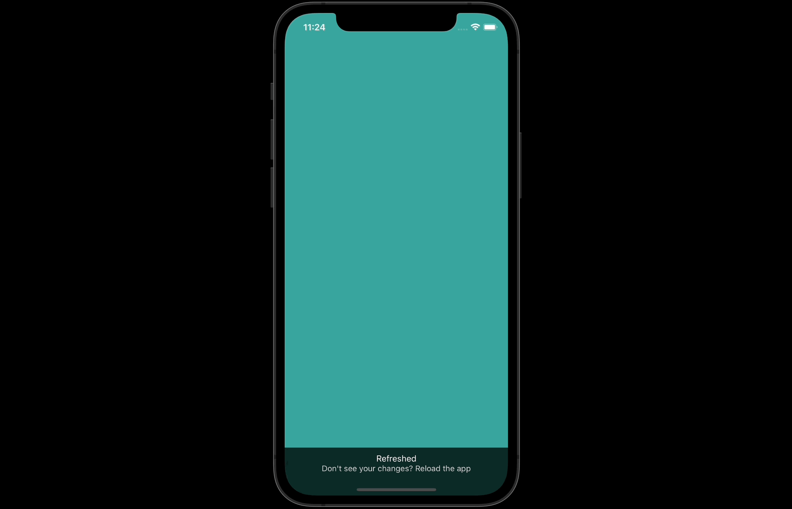

<div align="center" style="padding-bottom:30px; background:transparent">

</div>

## 💻 Projeto

Login é um aplicativo de tela de login com animações desenvolvido na aula
do Canal do Youtube do Sujeito Programador

- [Criando tela de login + Animações com React Native ](https://www.youtube.com/watch?v=GZ_QSVDTQRw)

## 🚀 Tecnologias utilizadas

- [Expo](https://expo.dev)
- [React native](https://reactnative.dev)
- [React native Animatable](https://github.com/oblador/react-native-animatable)
- [React Navigation](https://reactnavigation.org)

### Instalação

Caso não tenha o Expo instalado segue abaixo:

```
npm install --global expo-cli
```

Clone o repositório do Projeto

```
https://github.com/alessandre74/Login-Animatable.git
```

Acesse o diretório do projeto

```
cd login
```

Instale as dependências

```
yarn ou sudo yarn (com yarn )

npm install ou sudo npm install (com npm)
```

Start o aplicativo

```
expo start
```

Inicie o aplicativo

```
Para ios digite a letra i e para Android a letra a
```

## 📄 License

Este projeto está sob a licença MIT
